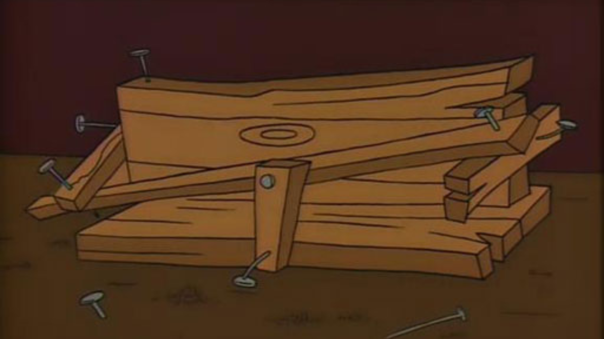

Couple of weeks ago I [wrote about all these new tools](/posts/2026-02-06-next-gen-r-tools/) that showed up in the R ecosystem, that seemed to aim to fill the gap for modern tooling and better developer experience. Then I bumped in the [excellent Python project template](https://github.com/gemmadanks/python-project-template) by Gemma Danks, and I thought to myself, why not make something similar for R? So here it is, an R project template with a focus on modularity and tooling.

{fig-alt="Homer Simpson's spice rack"}

But why I am presenting this with Homer Simpson's spice rack? Well, it is a project template, and it works, but it seems many things can be improved. For example:  
- Test coverage cannot be registered with codecov because it seems the R package `covr` does not work in this not-R-pacakage project structure.
- `pkgdown` cannot be used for documentation for the same reason as above.
- devtools::check() does not work because it expects a package structure with a DESCRIPTION file and an R/ directory for source code, which this template does not have.

Workarounds are of course possible, but these are kind of a goto tools for R projects, and I think many people would expect them to just work.

Even with these limitations, I think there is the learning curve for many to use `box` for writing modular R code, with `box` itself last time released in 2024.

But it works, and it is fun to see that it works. And it may be an alternative path for writing R code when we would like to avoid the classic package structure.

Code is here: [R project template](https://github.com/novica/r-project-template).

Let me know if you try it or just contribute on the repository.

