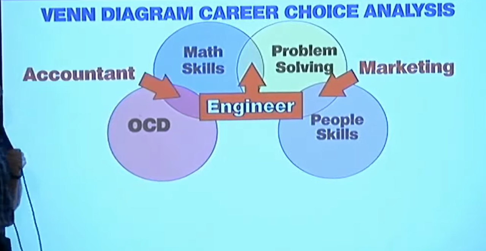

If you have ever done accounting, you probably know it is not much fun. If not here is a brief summary. There are bunch of rules to follow, coded into local, national, and international standards, and many modern ERP systems have them at least partially implemented and automated. There is not really creativity in the work -- well not unless you want to work in organised crime, and the profession is highly regulated. There is a lot of gate keeping about who can do the job, or who can do which part of the job, and what kind of certificates one must have, although the core of the accounting process is largely unchanged since it was codified sometime during the [renaissance or thereabouts](https://en.wikipedia.org/wiki/Luca_Pacioli).

No one has accounting as a hobby. There is no cool project in accounting you can share with your friends, and there aren't any interesting or thought provoking conferences or meetups where the topic is accounting. Was there ever an accountant speaking at TED? I haven't check, but if there was he/she was probably speaking about something else.

{fig-alt="The Career Venn Diagram by Don McMillan"}
So what has this have to do with software engineering? To use Don McMillan's funny diagram, we are now seeing a shift away from problem solving in software engineering. Instead of solving problems we are writing markdown documents that tell agents to solve a problem. And, even in these early days we see projects popping up with default `.md` files to do a certain tasks, or write in certain language. I think it is not before long we see a standard `.md` file to build an R package, or to build a FastAPI, or something else, with complexity of the problem being solved increasing over time.

There is a trajectory in which agent skill will become something akin to International Financial Reporting Standards. I think we are not far away from having the big companies producing "verified" skill (as I went to LinkedIn to post this I was greeted by a [post by Anton Abyzov](https://www.linkedin.com/posts/antonabyzov_ai-developertools-buildinpublic-share-7438679148476125184-8lnk) that talks about a [verified skill tool](https://verified-skill.com/) :) to do certain things in their ecosystem. Think for example "AWS verified skills for infrastructure", and maybe these will start to come with a price tag on a tier level, or even on regional level around the world. 

Then if you are a company working in software auditing, you will probably have a skill that will instruct your agent to audit the work of another agent. I would not be surprised if the Big 4 are already thinking about this.  

Where does this leave software engineers? No more problem solving, more OCD? I think it is not difficult to imagine future work being mostly reading `.md` files and trying to catch inconsistencies that slip through spell checkers or similar tools. Think someone typing `cat` instead of `car` in some `.md` file, and someone else trying to figure out where is the error coming from. That to me sounds much closer to tracking the stray balance mismatch on the balance sheet, than to improving a poorly implemented function that sometimes crashes the user's computer.

Is this good or bad? I guess it depends on being good or bad for whom or what. I think that even if this trajectory takes place, it will probably not affect the current generation of software engineers. 

However, not thinking about the other issues being raised (such as overall environmental concerns, employment outlook, and the stock market bubble), I think over time we are very likely to witness [tragedy of the commons](https://en.wikipedia.org/wiki/Tragedy_of_the_commons) unraveling in the free software world. 

Then maybe a lot of the software becomes like the cheap umbrellas you buy on the street form ad-hoc sellers when it suddenly starts to rain, and then they break after the second use and you toss them away. And maybe a lot of the software becomes a problem similar to the plastic in the oceans and [some engineers re-skill to deal with that](https://www.theguardian.com/world/2026/mar/15/cairo-fishers-catching-plastic-bottles). 

For the current generation I think it will put pressure on community building around software, hobby projects, and events. Think about it: why would I want to come to a meetup if we are to discuss your latest `.md` file? It is not meant for people anyway. Or why would I bother with reporting a bug or offering a pull request on a project that is largely build by a coding agent? The intrinsic motivation to help and be involved with people is simply gone. I would even say there is no motivation to send my agent subscription to do a pull request on your agent driven project. What would my lighting talk be at the next conference: how to format your `.md` file in 10 easy steps? There is a skill for that too. After all have you ever heard of an accounting community?